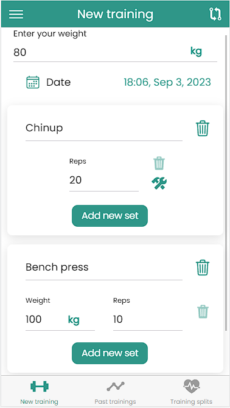

## About the project

This web application is my side project built for fun and it's purpose was to help me deepen my knowledge about Angular and other mentioned technologies.
Application's purpose is to help it's users to track and log their progress in the gym. 
It is initially designed to be used on mobile phones.

It has built in support for Android and iPhone devices.

## Built with
- 
- 
- 
- 
- 

## Main features
  - Log new training
  - View past trainings
  - Create custom training splits

### Log new training
This is the core feature of the application because it allows users to record and document their workouts.
Users can input details about their training session. This typically includes user's bodyweight, date of the workout, exercises performed and sets performed.
Users can log individual exercises they performed during the workout. This includes specifying the exercise name, the number of sets and reps and the weight or resistance used.
Additionally, users have these new training features at their disposal:
  - Reorder exercise order
  - Delete specific exercise
  - Change exercise set category

| Log new training                    | Change set category                 |
| ----------------------------------- | ----------------------------------- |
|  |  |
| Reorder exercises                   | Search exercises                |
|  |  |

### View past trainings
Users are able to access and review their historical workout data. This feature is essential for users to track their progress, analyze their training patterns and make informed decisions about their fitness routines.
Users are able to:
  - Search trainings by exercise names
  - Filter trainings by day or week
  - Filter trainings by muscle groups
  - Edit training
  - Delete training

| View past trainings                 |
| ----------------------------------- |
|  |

### Create custom training splits
Users are able to design personalized workout routines that align with their specific goals, preferences and schedules.
Users can create custom training splits or workout routines by defining the days of the week and the muscle groups or body parts they want to target on each of those days. This customization is typically based on their individual fitness goals, such as strength training, hypertrophy or endurance.
Additionally, with this feature, users can:
  - Edit training split
  - Delete training split
  - Set training split as active
  - Search training splits

| View training splits                | Create training split                 |
| ----------------------------------- | ----------------------------------- |
|  |  |

## User preferences
Individual user preferences refer to the unique settings, choices and configurations that users select or define within an application to tailor their experience to their liking.
Application supports three types of user preferences:
  - Change language
  - Change weight unit
  - Change set duration unit

### Change language
Users are able to change application language.
Currently, application supports two languages:
  - English
  - Croatian

| Change language                 |
| --------------------------------|
|  |

### Change weight unit
Users are able to change weight unit of the application.
Currently, application supports two weight units:
  - Kilograms
  - Pounds

| Change weight unit              |
| --------------------------------|
|  |

### Change set duration unit
Users are able to change set duration unit.
Currently, application supports two set duration units:
  - Seconds
  - Minutes

| Change set duration unit        |
| --------------------------------|
|  |

